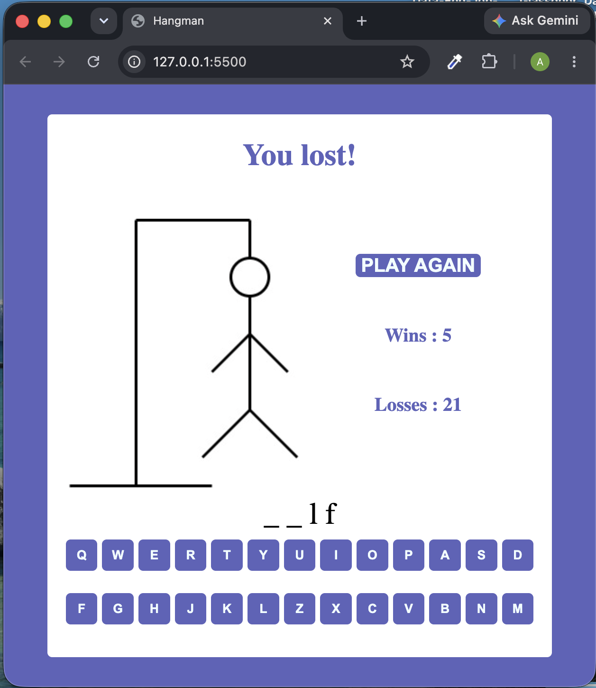

# Hangman

## Overview

A browser-based implementation of the classic Hangman game built with **HTML**, **SCSS**, and **JavaScript**.

The main objective of this project was to strengthen my JavaScript skills by building an interactive web application from scratch and applying modern frontend development concepts.

## Screenshot

## Features

- Random word generation
- Interactive on-screen keyboard
- Dynamic word rendering
- Hangman image progression
- Win and loss detection
- Play Again functionality
- Persistent game statistics using Local Storage

## JavaScript Focus

This project was built to practice:

- DOM manipulation
- Event listeners
- Functions and modular code organization
- ES6 modules (`import` / `export`)
- Classes and object-oriented programming
- Arrays and string manipulation
- Asynchronous JavaScript (`async` / `await`)
- Fetch API
- Local Storage
- Application state management

## Technologies

- HTML5
- SCSS
- JavaScript (ES6)
