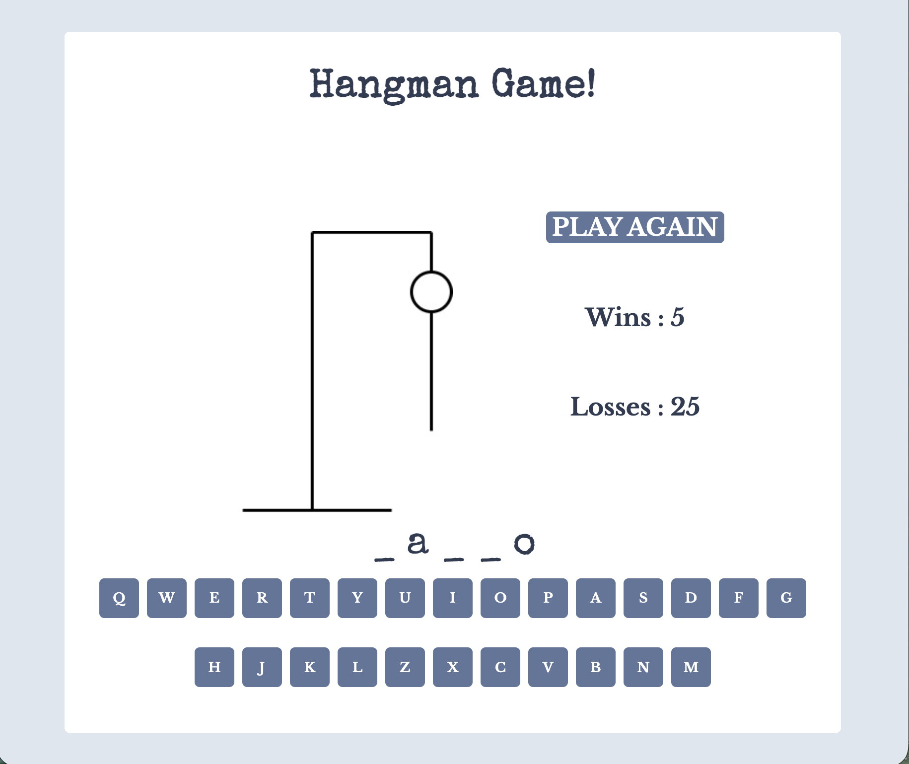

# Hangman

## Overview

Hangman is a browser-based implementation of the classic word guessing game built with **HTML**, **SCSS**, and **JavaScript**.

This project was created to strengthen my JavaScript skills by building an interactive application using modern frontend development practices.

## Screenshot

## Features

- Random word generation
- Interactive on-screen keyboard
- Dynamic word rendering
- Hangman image progression
- Win/loss detection
- Play Again functionality
- Game statistics saved with Local Storage

## JavaScript Concepts

- DOM manipulation
- Event listeners
- ES6 modules (`import` / `export`)
- Classes (OOP)
- Async/Await & Fetch API
- Local Storage
- State management

## Technologies

- HTML5
- SCSS
- JavaScript (ES6)
- Git & GitHub
